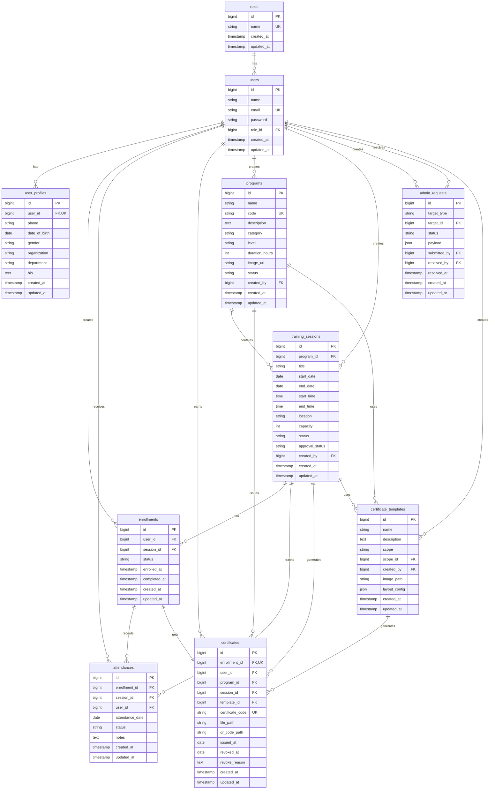

# Database Schema & ER Diagram

เอกสารนี้อธิบาย database structure และความสัมพันธ์ระหว่าง tables ในระบบ Training Management System

---

## Entity Relationship Diagram



---

## Table Descriptions

### 1. users

ตารางเก็บข้อมูลผู้ใช้ทั้งหมดในระบบ

| Column | Type | Description | Constraints |
|--------|------|-------------|-------------|
| id | bigint | Primary key | PK, AUTO_INCREMENT |
| name | varchar(255) | ชื่อผู้ใช้ | NOT NULL |
| email | varchar(255) | อีเมล | UNIQUE, NOT NULL |
| password | varchar(255) | รหัสผ่าน (hashed) | NOT NULL |
| role_id | bigint | Foreign key to roles | FK, NOT NULL |
| created_at | timestamp | วันที่สร้าง | |
| updated_at | timestamp | วันที่แก้ไขล่าสุด | |

**Indexes:**
- PRIMARY KEY (id)
- UNIQUE KEY (email)
- FOREIGN KEY (role_id) REFERENCES roles(id)

---

### 2. roles

ตารางเก็บบทบาทของผู้ใช้

| Column | Type | Description | Constraints |
|--------|------|-------------|-------------|
| id | bigint | Primary key | PK, AUTO_INCREMENT |
| name | varchar(255) | ชื่อ role | UNIQUE, NOT NULL |
| created_at | timestamp | วันที่สร้าง | |
| updated_at | timestamp | วันที่แก้ไขล่าสุด | |

**Possible Values:**
- `admin` - ผู้ดูแลระบบ
- `trainer` - วิทยากร
- `student` - ผู้เรียน

---

### 3. user_profiles

ตารางเก็บข้อมูลส่วนตัวเพิ่มเติมของผู้ใช้

| Column | Type | Description | Constraints |
|--------|------|-------------|-------------|
| id | bigint | Primary key | PK, AUTO_INCREMENT |
| user_id | bigint | Foreign key to users | FK, UNIQUE, NOT NULL |
| phone | varchar(20) | เบอร์โทรศัพท์ | |
| date_of_birth | date | วันเกิด | |
| gender | varchar(10) | เพศ | |
| organization | varchar(255) | องค์กร | |
| department | varchar(255) | แผนก | |
| bio | text | ข้อมูลเกี่ยวกับตัว | |
| created_at | timestamp | วันที่สร้าง | |
| updated_at | timestamp | วันที่แก้ไขล่าสุด | |

---

### 4. programs

ตารางเก็บข้อมูลหลักสูตรการอบรม

| Column | Type | Description | Constraints |
|--------|------|-------------|-------------|
| id | bigint | Primary key | PK, AUTO_INCREMENT |
| name | varchar(255) | ชื่อหลักสูตร | NOT NULL |
| code | varchar(50) | รหัสหลักสูตร | UNIQUE, NOT NULL |
| description | text | คำอธิบาย | |
| category | varchar(100) | หมวดหมู่ | |
| level | varchar(50) | ระดับความยาก | |
| duration_hours | int | จำนวนชั่วโมง | |
| image_url | varchar(500) | URL รูปภาพ | |
| status | varchar(20) | สถานะ | NOT NULL, DEFAULT 'draft' |
| created_by | bigint | ผู้สร้าง | FK |
| created_at | timestamp | วันที่สร้าง | |
| updated_at | timestamp | วันที่แก้ไขล่าสุด | |

**Status Values:**
- `draft` - ร่าง
- `published` - เผยแพร่แล้ว
- `active` - ใช้งาน
- `archived` - เก็บถาวร

---

### 5. training_sessions

ตารางเก็บข้อมูล session การอบรมแต่ละรอบ

| Column | Type | Description | Constraints |
|--------|------|-------------|-------------|
| id | bigint | Primary key | PK, AUTO_INCREMENT |
| program_id | bigint | Foreign key to programs | FK, NOT NULL |
| title | varchar(255) | ชื่อ session | NOT NULL |
| start_date | date | วันเริ่มต้น | NOT NULL |
| end_date | date | วันสิ้นสุด | NOT NULL |
| start_time | time | เวลาเริ่ม | |
| end_time | time | เวลาจบ | |
| location | varchar(255) | สถานที่ | |
| capacity | int | จำนวนที่รับ | NOT NULL |
| status | varchar(20) | สถานะ | NOT NULL, DEFAULT 'upcoming' |
| approval_status | varchar(20) | สถานะการอนุมัติ | NOT NULL, DEFAULT 'pending' |
| created_by | bigint | ผู้สร้าง | FK |
| created_at | timestamp | วันที่สร้าง | |
| updated_at | timestamp | วันที่แก้ไขล่าสุด | |

**Status Values:**
- `upcoming` - กำลังจะมาถึง
- `open` - เปิดรับสมัคร
- `closed` - ปิดรับสมัคร
- `completed` - เสร็จสิ้นแล้ว
- `cancelled` - ยกเลิก

**Approval Status Values:**
- `pending` - รอการอนุมัติ
- `approved` - อนุมัติแล้ว
- `rejected` - ปฏิเสธ

---

### 6. enrollments

ตารางเก็บข้อมูลการลงทะเบียนเรียน

| Column | Type | Description | Constraints |
|--------|------|-------------|-------------|
| id | bigint | Primary key | PK, AUTO_INCREMENT |
| user_id | bigint | Foreign key to users | FK, NOT NULL |
| session_id | bigint | Foreign key to training_sessions | FK, NOT NULL |
| status | varchar(20) | สถานะการลงทะเบียน | NOT NULL, DEFAULT 'pending' |
| enrolled_at | timestamp | วันที่ลงทะเบียน | NOT NULL |
| completed_at | timestamp | วันที่จบหลักสูตร | NULL |
| created_at | timestamp | วันที่สร้าง | |
| updated_at | timestamp | วันที่แก้ไขล่าสุด | |

**Status Values:**
- `pending` - รอการอนุมัติ
- `confirmed` - ยืนยันแล้ว
- `completed` - เรียนจบแล้ว (auto-set by system)
- `cancelled` - ยกเลิก

**Indexes:**
- PRIMARY KEY (id)
- UNIQUE KEY (user_id, session_id)
- FOREIGN KEY (user_id) REFERENCES users(id)
- FOREIGN KEY (session_id) REFERENCES training_sessions(id)

---

### 7. attendances

ตารางเก็บข้อมูลการเข้าเรียนแต่ละวัน

| Column | Type | Description | Constraints |
|--------|------|-------------|-------------|
| id | bigint | Primary key | PK, AUTO_INCREMENT |
| enrollment_id | bigint | Foreign key to enrollments | FK, NOT NULL |
| session_id | bigint | Foreign key to training_sessions | FK, NOT NULL |
| user_id | bigint | Foreign key to users | FK, NOT NULL |
| attendance_date | date | วันที่บันทึก | NOT NULL |
| status | varchar(20) | สถานะการเข้าเรียน | NOT NULL |
| notes | text | บันทึกเพิ่มเติม | NULL |
| created_at | timestamp | วันที่สร้าง | |
| updated_at | timestamp | วันที่แก้ไขล่าสุด | |

**Status Values:**
- `present` - มาเรียน (นับเป็นเข้าเรียน)
- `late` - มาสาย (นับเป็นเข้าเรียน)
- `absent` - ขาดเรียน (ไม่นับ)

**Indexes:**
- PRIMARY KEY (id)
- UNIQUE KEY (enrollment_id, attendance_date)
- FOREIGN KEY (enrollment_id) REFERENCES enrollments(id)
- FOREIGN KEY (session_id) REFERENCES training_sessions(id)
- FOREIGN KEY (user_id) REFERENCES users(id)

**Business Rules:**
- หนึ่ง enrollment มีได้ 1 attendance record ต่อ 1 วัน
- attendance_date ต้องอยู่ระหว่าง session.start_date และ session.end_date
- ใช้สำหรับคำนวณการผ่านหลักสูตร (80% attendance rule)

---

### 8. certificates

ตารางเก็บข้อมูลใบรับรองที่ออกให้ผู้เรียน

| Column | Type | Description | Constraints |
|--------|------|-------------|-------------|
| id | bigint | Primary key | PK, AUTO_INCREMENT |
| enrollment_id | bigint | Foreign key to enrollments | FK, UNIQUE, NOT NULL |
| user_id | bigint | Foreign key to users | FK, NOT NULL |
| program_id | bigint | Foreign key to programs | FK, NOT NULL |
| session_id | bigint | Foreign key to training_sessions | FK, NOT NULL |
| template_id | bigint | Foreign key to certificate_templates | FK, NULL |
| certificate_code | varchar(50) | รหัสใบรับรอง | UNIQUE, NOT NULL |
| file_path | varchar(500) | path ไฟล์ PDF | NOT NULL |
| qr_code_path | varchar(500) | path QR code | NULL |
| issued_at | date | วันที่ออกใบรับรอง | NOT NULL |
| revoked_at | date | วันที่เพิกถอน | NULL |
| revoke_reason | text | เหตุผลการเพิกถอน | NULL |
| created_at | timestamp | วันที่สร้าง | |
| updated_at | timestamp | วันที่แก้ไขล่าสุด | |

**Indexes:**
- PRIMARY KEY (id)
- UNIQUE KEY (enrollment_id)
- UNIQUE KEY (certificate_code)
- FOREIGN KEY (enrollment_id) REFERENCES enrollments(id)
- FOREIGN KEY (user_id) REFERENCES users(id)
- FOREIGN KEY (program_id) REFERENCES programs(id)
- FOREIGN KEY (session_id) REFERENCES training_sessions(id)
- FOREIGN KEY (template_id) REFERENCES certificate_templates(id)

**Business Rules:**
- หนึ่ง enrollment มีได้เพียง 1 certificate
- สามารถออกได้เมื่อ enrollment.status = 'completed' เท่านั้น

---

### 9. certificate_templates

ตารางเก็บ template สำหรับสร้างใบรับรอง

| Column | Type | Description | Constraints |
|--------|------|-------------|-------------|
| id | bigint | Primary key | PK, AUTO_INCREMENT |
| name | varchar(255) | ชื่อ template | NOT NULL |
| description | text | คำอธิบาย | NULL |
| scope | varchar(20) | ขอบเขตการใช้งาน | NOT NULL |
| scope_id | bigint | ID ของ scope (program/session) | NULL |
| created_by | bigint | ผู้สร้าง | FK, NOT NULL |
| image_path | varchar(500) | path รูป template | NOT NULL |
| layout_config | json | การตั้งค่า layout | NOT NULL |
| created_at | timestamp | วันที่สร้าง | |
| updated_at | timestamp | วันที่แก้ไขล่าสุด | |

**Scope Values:**
- `global` - ใช้ได้ทุก program/session
- `program` - ใช้เฉพาะ program ที่ระบุ (scope_id = program_id)
- `session` - ใช้เฉพาะ session ที่ระบุ (scope_id = session_id)

**Template Priority:**
1. Session-specific template (highest)
2. Program-specific template
3. Global template (fallback)

---

### 10. admin_requests

ตารางเก็บคำขออนุมัติต่างๆ (program, session, trainee, certificate)

| Column | Type | Description | Constraints |
|--------|------|-------------|-------------|
| id | bigint | Primary key | PK, AUTO_INCREMENT |
| target_type | varchar(50) | ประเภทคำขอ | NOT NULL |
| target_id | bigint | ID ของเป้าหมาย | NULL |
| status | varchar(20) | สถานะคำขอ | NOT NULL, DEFAULT 'pending' |
| payload | json | ข้อมูลคำขอ | NOT NULL |
| submitted_by | bigint | ผู้ส่งคำขอ | FK, NOT NULL |
| resolved_by | bigint | ผู้อนุมัติ/ปฏิเสธ | FK, NULL |
| resolved_at | timestamp | วันที่ตัดสิน | NULL |
| created_at | timestamp | วันที่สร้าง | |
| updated_at | timestamp | วันที่แก้ไขล่าสุด | |

**Target Type Values:**
- `program` - คำขอสร้างหลักสูตร
- `session` - คำขอสร้าง session
- `trainee` - คำขอเพิ่มผู้เรียน
- `certificate` - คำขอออกใบรับรอง

**Status Values:**
- `pending` - รออนุมัติ
- `approved` - อนุมัติแล้ว
- `rejected` - ปฏิเสธ

---

## Relationships Summary

### One-to-One
- `enrollments` → `certificates` (1:1)
- `users` → `user_profiles` (1:1)

### One-to-Many
- `users` → `enrollments` (1:N)
- `users` → `attendances` (1:N)
- `users` → `certificates` (1:N)
- `users` → `programs` (1:N, as creator)
- `users` → `training_sessions` (1:N, as creator)
- `programs` → `training_sessions` (1:N)
- `programs` → `certificates` (1:N)
- `training_sessions` → `enrollments` (1:N)
- `training_sessions` → `attendances` (1:N)
- `training_sessions` → `certificates` (1:N)
- `enrollments` → `attendances` (1:N)
- `certificate_templates` → `certificates` (1:N)

### Many-to-One
- `users` → `roles` (N:1)

---

## Database Constraints & Rules

### Foreign Key Constraints

```sql
ALTER TABLE users
    ADD CONSTRAINT fk_users_role_id
    FOREIGN KEY (role_id) REFERENCES roles(id)
    ON DELETE RESTRICT;

ALTER TABLE user_profiles
    ADD CONSTRAINT fk_user_profiles_user_id
    FOREIGN KEY (user_id) REFERENCES users(id)
    ON DELETE CASCADE;

ALTER TABLE programs
    ADD CONSTRAINT fk_programs_created_by
    FOREIGN KEY (created_by) REFERENCES users(id)
    ON DELETE SET NULL;

ALTER TABLE training_sessions
    ADD CONSTRAINT fk_training_sessions_program_id
    FOREIGN KEY (program_id) REFERENCES programs(id)
    ON DELETE CASCADE;

ALTER TABLE training_sessions
    ADD CONSTRAINT fk_training_sessions_created_by
    FOREIGN KEY (created_by) REFERENCES users(id)
    ON DELETE SET NULL;

ALTER TABLE enrollments
    ADD CONSTRAINT fk_enrollments_user_id
    FOREIGN KEY (user_id) REFERENCES users(id)
    ON DELETE CASCADE;

ALTER TABLE enrollments
    ADD CONSTRAINT fk_enrollments_session_id
    FOREIGN KEY (session_id) REFERENCES training_sessions(id)
    ON DELETE CASCADE;

ALTER TABLE attendances
    ADD CONSTRAINT fk_attendances_enrollment_id
    FOREIGN KEY (enrollment_id) REFERENCES enrollments(id)
    ON DELETE CASCADE;

ALTER TABLE attendances
    ADD CONSTRAINT fk_attendances_session_id
    FOREIGN KEY (session_id) REFERENCES training_sessions(id)
    ON DELETE CASCADE;

ALTER TABLE attendances
    ADD CONSTRAINT fk_attendances_user_id
    FOREIGN KEY (user_id) REFERENCES users(id)
    ON DELETE CASCADE;

ALTER TABLE certificates
    ADD CONSTRAINT fk_certificates_enrollment_id
    FOREIGN KEY (enrollment_id) REFERENCES enrollments(id)
    ON DELETE CASCADE;

ALTER TABLE certificates
    ADD CONSTRAINT fk_certificates_user_id
    FOREIGN KEY (user_id) REFERENCES users(id)
    ON DELETE CASCADE;

ALTER TABLE certificates
    ADD CONSTRAINT fk_certificates_program_id
    FOREIGN KEY (program_id) REFERENCES programs(id)
    ON DELETE CASCADE;

ALTER TABLE certificates
    ADD CONSTRAINT fk_certificates_session_id
    FOREIGN KEY (session_id) REFERENCES training_sessions(id)
    ON DELETE CASCADE;

ALTER TABLE certificates
    ADD CONSTRAINT fk_certificates_template_id
    FOREIGN KEY (template_id) REFERENCES certificate_templates(id)
    ON DELETE SET NULL;
```

### Check Constraints

```sql
ALTER TABLE enrollments
    ADD CONSTRAINT chk_enrollments_status
    CHECK (status IN ('pending', 'confirmed', 'completed', 'cancelled'));

ALTER TABLE training_sessions
    ADD CONSTRAINT chk_training_sessions_status
    CHECK (status IN ('upcoming', 'open', 'closed', 'completed', 'cancelled'));

ALTER TABLE training_sessions
    ADD CONSTRAINT chk_training_sessions_approval_status
    CHECK (approval_status IN ('pending', 'approved', 'rejected'));

ALTER TABLE attendances
    ADD CONSTRAINT chk_attendances_status
    CHECK (status IN ('present', 'late', 'absent'));

ALTER TABLE programs
    ADD CONSTRAINT chk_programs_status
    CHECK (status IN ('draft', 'published', 'active', 'archived'));

ALTER TABLE admin_requests
    ADD CONSTRAINT chk_admin_requests_status
    CHECK (status IN ('pending', 'approved', 'rejected'));

ALTER TABLE admin_requests
    ADD CONSTRAINT chk_admin_requests_target_type
    CHECK (target_type IN ('program', 'session', 'trainee', 'certificate'));
```

---

## Indexes for Performance

### Recommended Indexes

```sql
-- Search by email (for login)
CREATE INDEX idx_users_email ON users(email);

-- Search enrollments by user
CREATE INDEX idx_enrollments_user_id ON enrollments(user_id);

-- Search enrollments by session
CREATE INDEX idx_enrollments_session_id ON enrollments(session_id);

-- Search by enrollment status
CREATE INDEX idx_enrollments_status ON enrollments(status);

-- Search attendances by enrollment
CREATE INDEX idx_attendances_enrollment_id ON attendances(enrollment_id);

-- Search attendances by session
CREATE INDEX idx_attendances_session_id ON attendances(session_id);

-- Search attendances by date
CREATE INDEX idx_attendances_attendance_date ON attendances(attendance_date);

-- Search sessions by program
CREATE INDEX idx_training_sessions_program_id ON training_sessions(program_id);

-- Search sessions by status
CREATE INDEX idx_training_sessions_status ON training_sessions(status);

-- Search certificates by user
CREATE INDEX idx_certificates_user_id ON certificates(user_id);

-- Search certificates by program
CREATE INDEX idx_certificates_program_id ON certificates(program_id);

-- Verify certificate by code
CREATE INDEX idx_certificates_certificate_code ON certificates(certificate_code);

-- Search admin requests by status
CREATE INDEX idx_admin_requests_status ON admin_requests(status);

-- Search admin requests by type
CREATE INDEX idx_admin_requests_target_type ON admin_requests(target_type);
```

---

## Data Flow Diagram

### Enrollment → Attendance → Completion → Certificate

```
┌──────────┐       ┌─────────────────┐       ┌───────────────┐
│  User    │──────>│  Enrollment     │──────>│  Attendance   │
│          │ enroll│  (pending)      │ track │  (present/    │
└──────────┘       └─────────────────┘       │   late/absent)│
                            │                 └───────────────┘
                            │                         │
                            v                         │
                   ┌─────────────────┐               │
                   │ Admin Approve   │               │
                   │ enrollment →    │<──────────────┘
                   │ 'confirmed'     │
                   └─────────────────┘
                            │
                            v
                   ┌─────────────────┐
                   │ Trainer Marks   │
                   │ Session         │
                   │ 'completed'     │
                   └─────────────────┘
                            │
                            v
                   ┌─────────────────┐
                   │ System Auto-    │
                   │ Evaluate:       │
                   │ Attendance ≥80% │
                   └─────────────────┘
                            │
                ┌───────────┴───────────┐
                │                       │
                v                       v
        ┌───────────────┐      ┌───────────────┐
        │ enrollment    │      │ enrollment    │
        │ 'completed'   │      │ 'confirmed'   │
        │ completed_at  │      │ (failed)      │
        └───────────────┘      └───────────────┘
                │
                v
        ┌───────────────┐
        │ Certificate   │
        │ Generation    │
        │ Eligible      │
        └───────────────┘
                │
                v
        ┌───────────────┐
        │ Certificate   │
        │ Created with  │
        │ PDF + QR Code │
        └───────────────┘
```

---

## Change Log

| Date | Version | Changes |
|------|---------|---------|
| 2026-01-06 | 1.0 | Initial database schema documentation created |
| 2026-01-06 | 1.1 | Added attendances table and relationships |
| 2026-01-06 | 1.2 | Added certificates and certificate_templates tables |

---

## Related Documentation

- [Enrollment Flow](./ENROLLMENT_FLOW.md)
- [API Specification](./API-SPECIFICATION.md)
- [Sequence Diagrams](./SEQUENCE-DIAGRAMS.md)
