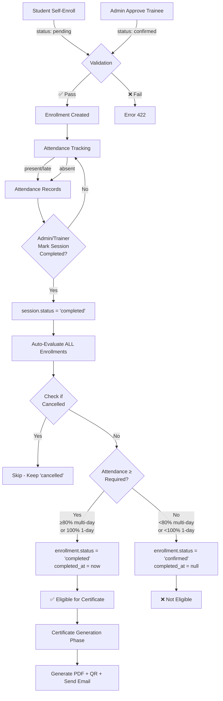

# Training Management System - Enrollment Flow Documentation

## Overview Flow

```
┌─────────────┐     ┌──────────────┐     ┌──────────────┐     ┌────────────────┐     ┌─────────────┐
│  Enrollment │ ──> │  Attendance  │ ──> │   Session    │ ──> │   Enrollment   │ ──> │ Certificate │
│             │     │   Tracking   │     │  Completion  │     │   Completion   │     │   Phase     │
└─────────────┘     └──────────────┘     └──────────────┘     └────────────────┘     └─────────────┘
```

---

## 1. Enrollment (ลงทะเบียน)

### 1.1 Enrollment Methods (วิธีการลงทะเบียน)

**A. Student Self-Enrollment**
- Path: `POST /api/enrollments`
- Controller: `EnrollmentController::store()`
- Initial Status: `pending`

**Validation Rules:**
```php
✓ Session must be approved
✓ Session status = 'open' only
✗ Session status = 'completed' → Error 422
✓ Capacity not full
✓ Not already enrolled (or previously cancelled)
```

**B. Admin/Trainer Approve Trainee**
- Path: `POST /api/admin/requests/{id}/approve` (target_type = 'trainee')
- Controller: `AdminRequestActionController::approveTrainee()`
- Initial Status: `confirmed`

**Validation Rules:**
```php
✓ Session exists
✓ Capacity not full
✓ Can enroll even if session = 'completed' (no status check)
```

### 1.2 Enrollment Status States

| Status | Description | Set By |
|--------|-------------|--------|
| `pending` | รอการอนุมัติ | Student self-enrollment |
| `confirmed` | ยืนยันแล้ว | Admin/Trainer approval |
| `completed` | ผ่านหลักสูตร | Auto-set by system on session completion |
| `cancelled` | ยกเลิก | Student cancellation |

### 1.3 Enrollment Rules Summary

| Action | Student Self-Enroll | Admin Approve Trainee |
|--------|---------------------|----------------------|
| Check session status | ✅ Must be 'open' | ❌ No check |
| Block if completed | ✅ Error 422 | ❌ Can proceed |
| Check capacity | ✅ Yes | ✅ Yes |

---

## 2. Attendance Tracking (บันทึกการเข้าเรียน)

### 2.1 Attendance Statuses

| Status | Counted as Attended? | Description |
|--------|---------------------|-------------|
| `present` | ✅ YES | มาเรียน |
| `late` | ✅ YES | มาสาย |
| `absent` | ❌ NO | ขาดเรียน |

**Code Reference:** `CompletionService.php:11`
```php
private const ATTENDED_STATUSES = ['present', 'late'];
```

### 2.2 Attendance Recording

- Managed by Admin/Trainer via session attendance pages
- Route Pattern: `/admin/courses/{courseCode}/sessions/{sessionId}/attendance`
- Route Pattern: `/trainer/courses/{courseCode}/sessions/{sessionId}/attendance`
- Each student receives one attendance record per session day

---

## 3. Session Completion (ปิด Session)

### 3.1 Trigger Endpoint

**API:** `POST /api/sessions/{id}/complete`

**Authorization:**
- Admin: Can complete any session
- Trainer: Can complete only their own sessions

**Controller:** `TrainingSessionController::complete()`

### 3.2 Validation Rules

```php
✓ Session status must be: 'open' or 'closed'
✗ Cannot complete if: 'upcoming', 'cancelled', or already 'completed'
✓ User must be admin OR session trainer
```

### 3.3 Process Flow

```php
// TrainingSessionController.php:146-148
$session->update(['status' => 'completed']);
$summary = $completionService->evaluateSessionCompletions($session->id);

return [
    'session' => $session->fresh(),
    'summary' => ['total' => X, 'completed' => Y]
];
```

**Step-by-step:**
1. ✅ Update `training_sessions.status = 'completed'`
2. ✅ Trigger automatic evaluation of ALL enrollments in this session
3. ✅ Return summary with total enrollments and how many completed

---

## 4. Enrollment Completion (ประเมินผลการเรียน)

### 4.1 Automatic Evaluation Trigger

**When:** Immediately after session is marked completed

**Service:** `CompletionService::evaluateSessionCompletions()`
- Loops through ALL enrollments for the session
- Calls `evaluateEnrollmentCompletion()` for each

### 4.2 Completion Criteria

**Constants:**
```php
ATTENDED_STATUSES = ['present', 'late']  // Line 11
MULTI_DAY_THRESHOLD = 0.8  // 80% - Line 12
```

**Algorithm:**
```php
// Calculate session days
totalDays = (end_date - start_date) + 1

// Count attended days
attendedCount = COUNT(attendances WHERE status IN ['present', 'late'])

// Determine required attendance
if (totalDays <= 1) {
    requiredCount = 1  // Must attend the single day
} else {
    requiredCount = CEILING(totalDays × 0.8)  // Must attend 80% of days
}

// Evaluate completion
if (attendedCount >= requiredCount) {
    enrollment.status = 'completed'
    enrollment.completed_at = NOW()
} else {
    enrollment.status = 'confirmed'  // Did not pass
    enrollment.completed_at = NULL
}
```

### 4.3 Completion Examples

| Session Duration | Total Days | Attended | Required | Calculation | Result |
|-----------------|-----------|----------|----------|-------------|--------|
| 1-day workshop | 1 | 1 | 1 | 1 ≥ 1 | ✅ Completed |
| 1-day workshop | 1 | 0 | 1 | 0 < 1 | ❌ Not completed |
| 5-day training | 5 | 5 | 4 | ceil(5×0.8)=4, 5≥4 | ✅ Completed |
| 5-day training | 5 | 4 | 4 | ceil(5×0.8)=4, 4≥4 | ✅ Completed |
| 5-day training | 5 | 3 | 4 | ceil(5×0.8)=4, 3<4 | ❌ Not completed |
| 3-day training | 3 | 3 | 3 | ceil(3×0.8)=3, 3≥3 | ✅ Completed |
| 3-day training | 3 | 2 | 3 | ceil(3×0.8)=3, 2<3 | ❌ Not completed |
| 10-day course | 10 | 8 | 8 | ceil(10×0.8)=8, 8≥8 | ✅ Completed |
| 10-day course | 10 | 7 | 8 | ceil(10×0.8)=8, 7<8 | ❌ Not completed |

**Important Notes:**
- `ceil(2.4) = 3` (always rounds up)
- Both `present` and `late` count as attended
- `absent` does not count

### 4.4 Special Cases

**Cancelled Enrollments:**
```php
if (enrollment.status === 'cancelled') {
    // Skip evaluation entirely
    // Status remains 'cancelled'
    // No changes made
}
```

**Code Reference:** `CompletionService.php:23-25`

---

## 5. Certificate Phase (ระยะออกใบรับรอง)

### 5.1 Prerequisites for Certificate Generation

```php
✓ enrollment.status = 'completed'
✓ enrollment.completed_at IS NOT NULL
✓ session.status = 'completed'
```

### 5.2 Certificate Generation

**Trigger Options:**
1. **Session-level:** Generate for all completed enrollments in one session
   - Endpoint: `POST /api/sessions/{id}/certificates/generate`

2. **Program-level:** Generate for all completed enrollments across all sessions
   - Endpoint: `POST /api/programs/{id}/certificates/generate`

**What Happens:**
- Filters enrollments with `status = 'completed'`
- Creates `Certificate` record for each
- Generates PDF file using template
- Sends email notification to student
- QR code embedded for verification

**Outputs:**
```json
{
    "total": 10,
    "generated": 8,
    "skipped": 2,
    "errors": []
}
```

---

## Complete Flow Diagram



---

## Database Schema

### Enrollments Table

```sql
CREATE TABLE enrollments (
    id BIGINT PRIMARY KEY,
    user_id BIGINT NOT NULL,
    session_id BIGINT NOT NULL,
    status ENUM('pending', 'confirmed', 'completed', 'cancelled') NOT NULL,
    enrolled_at TIMESTAMP NOT NULL,
    completed_at TIMESTAMP NULL,
    created_at TIMESTAMP,
    updated_at TIMESTAMP,

    FOREIGN KEY (user_id) REFERENCES users(id),
    FOREIGN KEY (session_id) REFERENCES training_sessions(id)
);
```

### Training Sessions Table

```sql
CREATE TABLE training_sessions (
    id BIGINT PRIMARY KEY,
    program_id BIGINT NOT NULL,
    title VARCHAR(255) NOT NULL,
    start_date DATE NOT NULL,
    end_date DATE NOT NULL,
    status ENUM('upcoming', 'open', 'closed', 'completed', 'cancelled') NOT NULL,
    capacity INT NOT NULL,
    created_at TIMESTAMP,
    updated_at TIMESTAMP,

    FOREIGN KEY (program_id) REFERENCES programs(id)
);
```

### Attendances Table

```sql
CREATE TABLE attendances (
    id BIGINT PRIMARY KEY,
    enrollment_id BIGINT NOT NULL,
    session_id BIGINT NOT NULL,
    user_id BIGINT NOT NULL,
    attendance_date DATE NOT NULL,
    status ENUM('present', 'late', 'absent') NOT NULL,
    created_at TIMESTAMP,
    updated_at TIMESTAMP,

    FOREIGN KEY (enrollment_id) REFERENCES enrollments(id),
    FOREIGN KEY (session_id) REFERENCES training_sessions(id),
    FOREIGN KEY (user_id) REFERENCES users(id)
);
```

---

## Key Files Reference

| Component | File Path | Key Lines |
|-----------|-----------|-----------|
| Student Enrollment | `app/Http/Controllers/Api/EnrollmentController.php` | 18-73 |
| Enrollment Validation (Session Status) | `app/Http/Controllers/Api/EnrollmentController.php` | 31-37 |
| Admin Approve Trainee | `app/Http/Controllers/Api/AdminRequestActionController.php` | 263-321 |
| Session Completion Endpoint | `app/Http/Controllers/Api/TrainingSessionController.php` | 127-154 |
| Session Completion Trigger | `app/Http/Controllers/Api/TrainingSessionController.php` | 146-148 |
| Evaluate All Enrollments | `app/Services/CompletionService.php` | 54-71 |
| Evaluate Single Enrollment | `app/Services/CompletionService.php` | 14-52 |
| Attended Statuses Constant | `app/Services/CompletionService.php` | 11 |
| 80% Threshold Constant | `app/Services/CompletionService.php` | 12 |
| Calculate Session Days | `app/Services/CompletionService.php` | 73-87 |

---

## Business Rules Summary

### Enrollment Business Rules

1. **Student Cannot Enroll After Session Completed**
   - Enforced in: `EnrollmentController.php:35-37`
   - Returns: HTTP 422 error

2. **Admin Can Enroll After Session Completed**
   - Not enforced in: `AdminRequestActionController.php`
   - This is intentional to allow late additions

3. **Capacity Limits Apply to Both**
   - Checked for student enrollment
   - Checked for admin approval

### Completion Business Rules

1. **Single-Day Sessions**
   - Must attend 100% (1 out of 1 day)
   - No exceptions

2. **Multi-Day Sessions**
   - Must attend ≥80% of days
   - Calculated as: `ceil(totalDays × 0.8)`
   - Example: 3-day requires 3 days (ceil(2.4) = 3)

3. **Attendance Counting**
   - `present` ✅ Counts
   - `late` ✅ Counts
   - `absent` ❌ Does not count

4. **Cancelled Enrollments**
   - Never evaluated for completion
   - Status remains `cancelled`

---

## API Endpoints Summary

### Enrollment Endpoints

```http
POST /api/enrollments
Body: { "session_id": 123 }
Response: { "data": Enrollment, "message": "..." }
```

### Session Completion Endpoint

```http
POST /api/sessions/{id}/complete
Auth: Admin or Session Trainer
Response: {
    "session": Session,
    "summary": { "total": 10, "completed": 7 }
}
```

### Certificate Generation Endpoints

```http
POST /api/sessions/{id}/certificates/generate
POST /api/programs/{id}/certificates/generate
Auth: Admin or Trainer
Response: {
    "total": 10,
    "generated": 8,
    "skipped": 2
}
```

---

## Testing Scenarios

### Scenario 1: Student Completes 5-Day Training

```
Given: 5-day training session (Mon-Fri)
When: Student attends Mon, Tue, Wed, Thu (4 days)
And: Admin marks session as completed
Then:
  - Required = ceil(5 × 0.8) = 4 days
  - Attended = 4 days
  - Result: enrollment.status = 'completed' ✅
```

### Scenario 2: Student Fails 5-Day Training

```
Given: 5-day training session (Mon-Fri)
When: Student attends Mon, Tue, Wed (3 days)
And: Admin marks session as completed
Then:
  - Required = ceil(5 × 0.8) = 4 days
  - Attended = 3 days
  - Result: enrollment.status = 'confirmed' ❌
```

### Scenario 3: Late Arrival Counts as Attended

```
Given: 3-day workshop
When: Student has attendance records:
  - Day 1: 'present'
  - Day 2: 'late'
  - Day 3: 'present'
And: Admin marks session as completed
Then:
  - Required = ceil(3 × 0.8) = 3 days
  - Attended = 3 days (present + late + present)
  - Result: enrollment.status = 'completed' ✅
```

### Scenario 4: Cancelled Enrollment Not Evaluated

```
Given: Student was enrolled but cancelled
When: enrollment.status = 'cancelled'
And: Admin marks session as completed
Then:
  - Evaluation is skipped
  - Status remains 'cancelled'
  - completed_at remains NULL
```

---

## Troubleshooting

### Issue: Enrollment Not Marked Completed Despite Good Attendance

**Check:**
1. Was session marked as `completed`?
2. Does attendance record have `present` or `late` (not `absent`)?
3. Did student meet the 80% threshold?
4. Calculate: `ceil(totalDays × 0.8)` vs actual attendance
5. Is enrollment status `cancelled`?

### Issue: Student Cannot Enroll in Completed Session

**This is expected behavior:**
- Student self-enrollment blocks completed sessions
- Use admin approval to add students to completed sessions

### Issue: Certificate Not Generated

**Prerequisites:**
1. `enrollment.status = 'completed'` ✅
2. `enrollment.completed_at IS NOT NULL` ✅
3. `session.status = 'completed'` ✅

---

## Change Log

| Date | Version | Changes |
|------|---------|---------|
| 2026-01-06 | 1.0 | Initial documentation created |

---

## Related Documentation

- [API Specification](./API-SPECIFICATION.md)
- [Admin Guide](./ADMIN_GUIDE.md)
- [Sequence Diagrams](./SEQUENCE-DIAGRAMS.md)
- [Testing Summary](./TESTING_SUMMARY.md)
