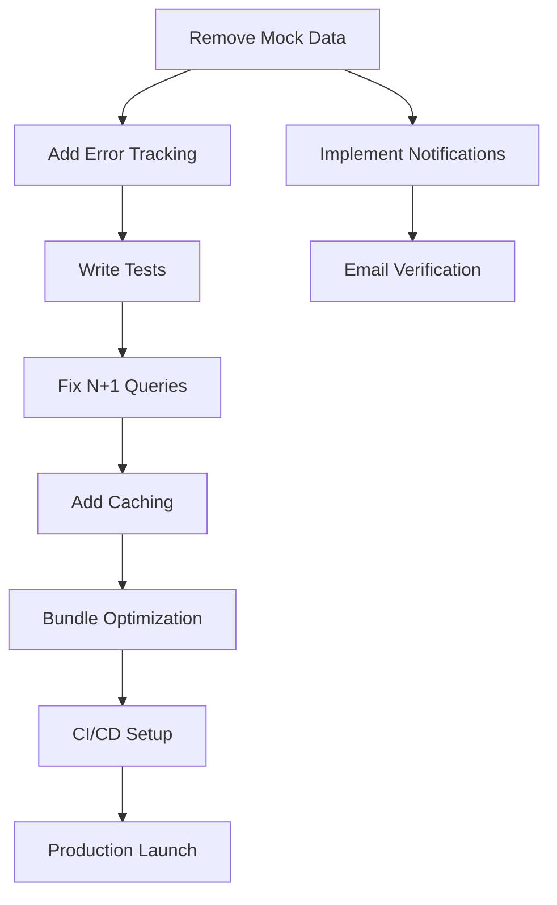

# Implementation Plan - Training Management System
## Production Readiness Roadmap

**Created:** January 27, 2026  
**Target:** Production-ready in 6-8 weeks  
**Based on:** Senior Developer Code Review

---

## Timeline Overview

- **Phase 1 (Week 1-2):** Critical Fixes - 🔴 Production Blockers
- **Phase 2 (Week 3-4):** Core Features - 🟠 Essential Functionality  
- **Phase 3 (Week 5-6):** Quality & Performance - 🟡 Optimization
- **Phase 4 (Week 7-8):** Polish & Launch Prep - 🟢 Nice-to-Have

**Total Estimated Effort:** 120-150 developer hours

---

## PHASE 1: CRITICAL FIXES (Week 1-2)
**Goal:** Fix production blockers and security issues  
**Duration:** 10-15 days | **Effort:** 40-50 hours

### Task 1.1: Remove Mock Data from Feedback System 🔴
**Priority:** CRITICAL | **Effort:** 6-8 hours | **Assignee:** Frontend + Backend Dev

**Problem:**
- `Admin/Feedback.vue` and `Trainer/Feedback.vue` use `mockFeedbacks` from `@/mockData/feedbackData.js`
- Exports (CSV/PDF) contain fake data
- No real business value from these pages

**Implementation Steps:**

#### 1.1.1 Backend API Integration (3 hours)
```php
// Create: app/Http/Controllers/Api/FeedbackController.php

class FeedbackController extends Controller
{
    public function adminFeedback(Request $request)
    {
        // Get all completed sessions with reviews
        $sessions = TrainingSession::with(['course', 'trainer', 'reviews.user'])
            ->where('status', 'completed')
            ->when($request->search, function ($query, $search) {
                $query->where('title', 'like', "%{$search}%")
                    ->orWhereHas('course', fn($q) => $q->where('title', 'like', "%{$search}%"));
            })
            ->when($request->status, function ($query, $status) {
                $query->where('status', $status);
            })
            ->get()
            ->map(function ($session) {
                return [
                    'id' => $session->id,
                    'title' => $session->title,
                    'course_name' => $session->course->title,
                    'trainer_name' => $session->trainer->name,
                    'start_date' => $session->sessionDays->sortBy('date')->first()?->date,
                    'total_reviews' => $session->reviews->count(),
                    'average_rating' => $session->reviews->avg('overall_rating'),
                    'reviews' => $session->reviews->map(fn($r) => [
                        'reviewer_name' => $r->user->name,
                        'rating' => $r->overall_rating,
                        'comment' => $r->comments,
                        'created_at' => $r->created_at->format('M d, Y'),
                    ]),
                ];
            });

        return response()->json(['data' => $sessions]);
    }

    public function trainerFeedback(Request $request)
    {
        $user = $request->user();
        // Similar to adminFeedback but filtered by trainer_id
        $sessions = TrainingSession::with(['course', 'reviews.user'])
            ->where('trainer_id', $user->id)
            ->where('status', 'completed')
            ->get();

        return response()->json(['data' => $sessions]);
    }
}
```

```php
// Add to routes/api.php
Route::middleware(['auth:sanctum'])->group(function () {
    Route::get('admin/feedback', [FeedbackController::class, 'adminFeedback'])
        ->middleware('role:admin');
    Route::get('trainer/feedback', [FeedbackController::class, 'trainerFeedback'])
        ->middleware('role:trainer,admin');
});
```

#### 1.1.2 Frontend Refactor (3-4 hours)

**File:** `resources/js/Pages/Admin/Feedback.vue`
```vue
<script setup>
import { ref, onMounted, computed } from 'vue';
import { Head } from '@inertiajs/vue3';
import axios from 'axios';

const sessions = ref([]);
const loading = ref(false);
const searchQuery = ref('');
const statusFilter = ref('all');

const fetchFeedback = async () => {
    loading.value = true;
    try {
        const { data } = await axios.get('/api/admin/feedback', {
            params: {
                search: searchQuery.value,
                status: statusFilter.value !== 'all' ? statusFilter.value : null
            }
        });
        sessions.value = data.data;
    } catch (error) {
        console.error('Failed to fetch feedback:', error);
    } finally {
        loading.value = false;
    }
};

onMounted(() => fetchFeedback());

// Calculate stats from real data
const stats = computed(() => {
    const allReviews = sessions.value.flatMap(s => s.reviews || []);
    return {
        totalReviews: allReviews.length,
        averageRating: allReviews.reduce((sum, r) => sum + r.rating, 0) / allReviews.length || 0,
        // ... calculate other stats
    };
});

const exportToCSV = () => {
    const allReviews = sessions.value.flatMap(s => 
        s.reviews.map(r => ({
            session: s.title,
            course: s.course_name,
            reviewer: r.reviewer_name,
            rating: r.rating,
            comment: r.comment,
            date: r.created_at
        }))
    );
    
    const headers = ['Session', 'Course', 'Reviewer', 'Rating', 'Comment', 'Date'];
    const csvData = allReviews.map(r => [
        r.session, r.course, r.reviewer, r.rating, 
        `"${r.comment?.replace(/"/g, '""') || ''}"`, r.date
    ]);
    
    const csv = [headers.join(','), ...csvData.map(row => row.join(','))].join('\n');
    
    const blob = new Blob([csv], { type: 'text/csv' });
    const url = window.URL.createObjectURL(blob);
    const link = document.createElement('a');
    link.href = url;
    link.download = `feedback-export-${new Date().toISOString().split('T')[0]}.csv`;
    link.click();
    window.URL.revokeObjectURL(url);
};
</script>

<template>
    <Head title="Feedback & Reviews" />
    <AdminLayout>
        <div v-if="loading" class="text-center py-12">
            <div class="animate-spin rounded-full h-12 w-12 border-b-2 border-blue-600 mx-auto"></div>
            <p class="mt-4 text-gray-600">Loading feedback data...</p>
        </div>
        
        <div v-else class="space-y-6">
            <!-- Search and filters -->
            <div class="flex gap-4">
                <input
                    v-model="searchQuery"
                    @input="fetchFeedback"
                    type="text"
                    placeholder="Search sessions..."
                    class="flex-1 px-4 py-2 border rounded-lg"
                />
                <select v-model="statusFilter" @change="fetchFeedback" class="px-4 py-2 border rounded-lg">
                    <option value="all">All Status</option>
                    <option value="completed">Completed</option>
                </select>
            </div>

            <!-- Stats Display -->
            <div class="grid grid-cols-3 gap-4">
                <div class="bg-white p-6 rounded-lg shadow">
                    <h3 class="text-gray-500 text-sm">Total Reviews</h3>
                    <p class="text-3xl font-bold">{{ stats.totalReviews }}</p>
                </div>
                <div class="bg-white p-6 rounded-lg shadow">
                    <h3 class="text-gray-500 text-sm">Average Rating</h3>
                    <p class="text-3xl font-bold">{{ stats.averageRating.toFixed(1) }}</p>
                </div>
            </div>

            <!-- Sessions List -->
            <div class="grid gap-4">
                <div v-for="session in sessions" :key="session.id" 
                     class="bg-white p-6 rounded-lg shadow hover:shadow-lg transition">
                    <h3 class="font-bold text-lg">{{ session.title }}</h3>
                    <p class="text-gray-600">{{ session.course_name }}</p>
                    <div class="mt-2 flex items-center gap-4 text-sm text-gray-500">
                        <span>Trainer: {{ session.trainer_name }}</span>
                        <span>{{ session.total_reviews }} reviews</span>
                        <span>★ {{ session.average_rating?.toFixed(1) || 'N/A' }}</span>
                    </div>
                </div>
            </div>

            <!-- Export Button -->
            <button @click="exportToCSV" 
                    class="px-6 py-3 bg-blue-600 text-white rounded-lg hover:bg-blue-700">
                Export to CSV
            </button>
        </div>
    </AdminLayout>
</template>
```

#### 1.1.3 Delete Mock Data (1 hour)
```bash
# Remove mock data file
rm resources/js/mockData/feedbackData.js

# Update Trainer/Feedback.vue similarly (copy pattern from Admin)
```

**Testing Checklist:**
- [ ] Admin can see all session feedback
- [ ] Trainer sees only their session feedback
- [ ] Search and filters work correctly
- [ ] CSV export contains real data
- [ ] No console errors
- [ ] Loading states display properly

---

### Task 1.2: Implement Error Tracking (Sentry) 🔴
**Priority:** CRITICAL | **Effort:** 3-4 hours | **Assignee:** Backend Dev

**Implementation Steps:**

#### 1.2.1 Install Sentry (1 hour)
```bash
composer require sentry/sentry-laravel
php artisan sentry:publish --dsn
```

```env
# Add to .env
SENTRY_LARAVEL_DSN=https://your-dsn@sentry.io/project-id
SENTRY_TRACES_SAMPLE_RATE=1.0
SENTRY_ENVIRONMENT=production
```

```php
// config/sentry.php - Update release tracking
'release' => trim(exec('git --git-dir ' . base_path('.git') . ' log --pretty="%h" -n1 HEAD')),
```

#### 1.2.2 Configure Error Handling (2 hours)
```php
// app/Exceptions/Handler.php
public function register(): void
{
    $this->reportable(function (Throwable $e) {
        if (app()->bound('sentry')) {
            app('sentry')->captureException($e);
        }
    });
}
```

```javascript
// resources/js/app.js - Frontend error tracking
import * as Sentry from "@sentry/vue";

Sentry.init({
    app,
    dsn: import.meta.env.VITE_SENTRY_DSN,
    environment: import.meta.env.VITE_APP_ENV,
    integrations: [
        new Sentry.BrowserTracing(),
        new Sentry.Replay(),
    ],
    tracesSampleRate: 1.0,
    replaysSessionSampleRate: 0.1,
    replaysOnErrorSampleRate: 1.0,
});
```

**Testing:**
```php
// Create test route to verify Sentry
Route::get('/test-sentry', function () {
    throw new \Exception('Test Sentry Integration');
});
```

---

### Task 1.3: Clean Up Dead Routes 🔴
**Priority:** CRITICAL | **Effort:** 2 hours | **Assignee:** Backend Dev

**Problem:**
- Certificate template routes exist but table was dropped
- Routes return 404 or errors

**Implementation:**

```php
// routes/web.php - REMOVE these lines (348-360):

// DELETE:
Route::get('/admin/certificate-templates', function () {
    return Inertia::render('Admin/CertificateTemplates/Index');
})->name('admin.certificate-templates.index');

Route::get('/admin/certificate-templates/create', function () {
    return Inertia::render('Admin/CertificateTemplates/Create');
})->name('admin.certificate-templates.create');

Route::get('/admin/certificate-templates/{id}/edit', function ($id) {
    return Inertia::render('Admin/CertificateTemplates/Edit', [
        'templateId' => $id,
    ]);
})->name('admin.certificate-templates.edit');
```

**Update Documentation:**
```markdown
# .markdown/docs/BUSINESS_RULES.md - Update section 5.3

## 5.3 Certificate Template

**Current Implementation:** Fixed Template
- All certificates use the standard template in CertificateRenderer.php
- No custom template support (removed in v2.0)
- Template includes: course name, trainee name, dates, QR verification

**Previous Version:** Custom templates were supported but removed for consistency
```

**Testing:**
- [ ] Verify routes are removed: `php artisan route:list | grep certificate-template`
- [ ] Check admin UI doesn't have broken certificate template links
- [ ] Update any sidebar/navigation that references templates

---

### Task 1.4: Fix/Remove Incomplete Command 🔴
**Priority:** CRITICAL | **Effort:** 2 hours | **Assignee:** Backend Dev

**Decision Required:** The `EvaluateEnrollmentCompletions` command is incomplete because completion logic already exists in `CompletionService.php` (triggered when sessions are marked complete).

**Option A: Remove Command (Recommended - 1 hour)**
```bash
# Delete the file
rm app/Console/Commands/EvaluateEnrollmentCompletions.php

# Remove from Kernel.php if registered
# Verify no cron jobs reference this command
```

**Option B: Implement as Scheduled Job (3 hours - if needed)**
```php
// app/Console/Commands/EvaluateEnrollmentCompletions.php
public function handle(CompletionService $completionService)
{
    $this->info('Evaluating enrollments for completion...');
    
    // Find sessions completed in last 24h that might need re-evaluation
    $sessions = TrainingSession::where('status', 'completed')
        ->where('updated_at', '>=', now()->subDay())
        ->get();
    
    $totalUpdated = 0;
    
    foreach ($sessions as $session) {
        $summary = $completionService->evaluateEnrollments($session);
        $totalUpdated += $summary['completed'];
        
        $this->info("Session {$session->id}: {$summary['completed']} completions");
    }
    
    $this->info("Successfully evaluated {$totalUpdated} enrollments.");
    return Command::SUCCESS;
}
```

**Recommendation:** Choose Option A (remove) since completion is already handled automatically.

---

## PHASE 2: CORE FEATURES (Week 3-4)
**Goal:** Complete essential missing features  
**Duration:** 10-12 days | **Effort:** 40-45 hours

### Task 2.1: Implement Notification System Backend 🟠
**Priority:** HIGH | **Effort:** 10-12 hours | **Assignee:** Full-stack Dev

**Current State:**
- UI exists with dropdowns
- All API calls are TODOs in `AdminLayout.vue`

**Implementation Steps:**

#### 2.1.1 Database Migration (1 hour)
```bash
php artisan make:migration create_notifications_table
```

```php
Schema::create('notifications', function (Blueprint $table) {
    $table->uuid('id')->primary();
    $table->string('type');
    $table->morphs('notifiable');
    $table->text('data');
    $table->timestamp('read_at')->nullable();
    $table->timestamps();
});

Schema::create('notification_settings', function (Blueprint $table) {
    $table->id();
    $table->foreignId('user_id')->constrained()->cascadeOnDelete();
    $table->string('type');
    $table->boolean('email_enabled')->default(true);
    $table->boolean('web_enabled')->default(true);
    $table->timestamps();
    $table->unique(['user_id', 'type']);
});
```

#### 2.1.2 Notification Classes (2 hours)
```php
// app/Notifications/EnrollmentCreated.php
use Illuminate\Notifications\Notification;

class EnrollmentCreated extends Notification
{
    public function __construct(
        public Enrollment $enrollment
    ) {}

    public function via($notifiable): array
    {
        return ['database', 'mail'];
    }

    public function toArray($notifiable): array
    {
        return [
            'type' => 'enrollment_created',
            'title' => 'New Enrollment',
            'message' => "{$this->enrollment->user->name} enrolled in {$this->enrollment->session->title}",
            'action_url' => route('admin.sessions.index'),
            'enrollment_id' => $this->enrollment->id,
            'created_at' => now()->toISOString(),
        ];
    }
}

// Similar notifications:
// - SessionCompleted
// - CertificateGenerated
// - AdminRequestCreated
// - AttendanceRecorded
```

#### 2.1.3 Controller (3 hours)
```php
// app/Http/Controllers/Api/NotificationController.php
class NotificationController extends Controller
{
    public function index(Request $request)
    {
        $notifications = $request->user()
            ->notifications()
            ->latest()
            ->limit(50)
            ->get()
            ->map(fn($n) => [
                'id' => $n->id,
                'type' => $n->data['type'] ?? 'general',
                'title' => $n->data['title'] ?? '',
                'message' => $n->data['message'] ?? '',
                'action_url' => $n->data['action_url'] ?? null,
                'read' => !is_null($n->read_at),
                'created_at' => $n->created_at->diffForHumans(),
            ]);

        return response()->json(['data' => $notifications]);
    }

    public function markAsRead(Request $request, string $id)
    {
        $notification = $request->user()
            ->notifications()
            ->findOrFail($id);
        
        $notification->markAsRead();
        
        return response()->json(['message' => 'Notification marked as read']);
    }

    public function markAllAsRead(Request $request)
    {
        $request->user()->unreadNotifications->markAsRead();
        
        return response()->json(['message' => 'All notifications marked as read']);
    }

    public function delete(Request $request, string $id)
    {
        $request->user()
            ->notifications()
            ->findOrFail($id)
            ->delete();
        
        return response()->json(['message' => 'Notification deleted']);
    }

    public function deleteAll(Request $request)
    {
        $request->user()->notifications()->delete();
        
        return response()->json(['message' => 'All notifications cleared']);
    }

    public function unreadCount(Request $request)
    {
        $count = $request->user()->unreadNotifications()->count();
        
        return response()->json(['count' => $count]);
    }
}
```

#### 2.1.4 Routes (30 min)
```php
// routes/api.php
Route::middleware(['auth:sanctum'])->group(function () {
    Route::get('notifications', [NotificationController::class, 'index']);
    Route::get('notifications/unread-count', [NotificationController::class, 'unreadCount']);
    Route::post('notifications/{id}/read', [NotificationController::class, 'markAsRead']);
    Route::post('notifications/read-all', [NotificationController::class, 'markAllAsRead']);
    Route::delete('notifications/{id}', [NotificationController::class, 'delete']);
    Route::delete('notifications', [NotificationController::class, 'deleteAll']);
});
```

#### 2.1.5 Trigger Notifications (2 hours)
```php
// app/Http/Controllers/Api/EnrollmentController.php - Update store method
public function store(Request $request)
{
    // ... existing validation
    
    $enrollment = Enrollment::create([...]);
    
    // Send notification to admins and session trainer
    $admins = User::whereHas('role', fn($q) => $q->where('name', 'admin'))->get();
    Notification::send($admins, new EnrollmentCreated($enrollment));
    
    if ($enrollment->session->trainer) {
        $enrollment->session->trainer->notify(new EnrollmentCreated($enrollment));
    }
    
    return response()->json([...]);
}

// Similarly update:
// - TrainingSessionController::complete()
// - CertificateController::generateBatch()
// - AdminRequestController::store()
```

#### 2.1.6 Frontend Integration (3 hours)
```vue
<!-- resources/js/Layouts/AdminLayout.vue -->
<script setup>
import { ref, onMounted } from 'vue';
import axios from 'axios';

const notifications = ref([]);
const unreadCount = ref(0);

const loadNotifications = async () => {
    const { data } = await axios.get('/api/notifications');
    notifications.value = data.data;
};

const loadUnreadCount = async () => {
    const { data } = await axios.get('/api/notifications/unread-count');
    unreadCount.value = data.count;
};

const markAsRead = async (id) => {
    await axios.post(`/api/notifications/${id}/read`);
    await loadNotifications();
    await loadUnreadCount();
};

const clearAll = async () => {
    await axios.delete('/api/notifications');
    notifications.value = [];
    unreadCount.value = 0;
};

onMounted(() => {
    loadNotifications();
    loadUnreadCount();
    
    // Poll every 30 seconds
    setInterval(() => {
        loadUnreadCount();
    }, 30000);
});
</script>

<template>
    <!-- Notification Bell -->
    <button class="relative">
        <Bell :size="24" />
        <span v-if="unreadCount > 0" 
              class="absolute -top-1 -right-1 bg-red-500 text-white text-xs rounded-full h-5 w-5 flex items-center justify-center">
            {{ unreadCount > 9 ? '9+' : unreadCount }}
        </span>
    </button>
    
    <!-- Notification Dropdown -->
    <div class="notifications-dropdown">
        <div v-for="notification in notifications" :key="notification.id"
             class="notification-item"
             :class="{ 'unread': !notification.read }"
             @click="markAsRead(notification.id)">
            <h4>{{ notification.title }}</h4>
            <p>{{ notification.message }}</p>
            <span class="time">{{ notification.created_at }}</span>
        </div>
        
        <button v-if="notifications.length > 0" @click="clearAll">
            Clear All
        </button>
    </div>
</template>
```

**Testing Checklist:**
- [ ] Enrollment creates notification for admin
- [ ] Session completion notifies trainer
- [ ] Notification count updates in real-time
- [ ] Mark as read works
- [ ] Clear all notifications works
- [ ] Email notifications send correctly

---

### Task 2.2: Add Automated Tests 🟠
**Priority:** HIGH | **Effort:** 14-16 hours | **Assignee:** Backend Dev

**Goal:** Achieve 60-70% coverage on critical paths

#### 2.2.1 Setup Test Environment (1 hour)
```xml
<!-- phpunit.xml - Verify configuration -->
<env name="APP_ENV" value="testing"/>
<env name="DB_CONNECTION" value="sqlite"/>
<env name="DB_DATABASE" value=":memory:"/>
```

#### 2.2.2 Enrollment Workflow Tests (4 hours)
```php
// tests/Feature/EnrollmentWorkflowTest.php
class EnrollmentWorkflowTest extends TestCase
{
    use RefreshDatabase;

    protected function setUp(): void
    {
        parent::setUp();
        $this->seed([RoleSeeder::class, UserSeeder::class]);
    }

    /** @test */
    public function student_can_enroll_in_open_session()
    {
        $student = User::factory()->create(['role_id' => Role::TRAINEE]);
        $session = TrainingSession::factory()->create([
            'status' => 'open',
            'approval_status' => 'approved',
            'capacity' => 30,
        ]);

        $this->actingAs($student, 'sanctum')
            ->postJson('/api/enrollments', ['session_id' => $session->id])
            ->assertStatus(201)
            ->assertJsonPath('data.status', 'pending');

        $this->assertDatabaseHas('enrollments', [
            'user_id' => $student->id,
            'session_id' => $session->id,
            'status' => 'pending',
        ]);
    }

    /** @test */
    public function cannot_enroll_in_closed_session()
    {
        $student = User::factory()->create(['role_id' => Role::TRAINEE]);
        $session = TrainingSession::factory()->create(['status' => 'closed']);

        $this->actingAs($student, 'sanctum')
            ->postJson('/api/enrollments', ['session_id' => $session->id])
            ->assertStatus(422)
            ->assertJsonValidationErrors(['session_id']);
    }

    /** @test */
    public function cannot_enroll_in_full_session()
    {
        $student = User::factory()->create(['role_id' => Role::TRAINEE]);
        $session = TrainingSession::factory()->create([
            'status' => 'open',
            'capacity' => 1,
        ]);

        // Fill the session
        Enrollment::factory()->create([
            'session_id' => $session->id,
            'status' => 'confirmed',
        ]);

        $this->actingAs($student, 'sanctum')
            ->postJson('/api/enrollments', ['session_id' => $session->id])
            ->assertStatus(422);
    }

    /** @test */
    public function can_cancel_enrollment_before_start_date()
    {
        $student = User::factory()->create(['role_id' => Role::TRAINEE]);
        $enrollment = Enrollment::factory()->create([
            'user_id' => $student->id,
            'status' => 'confirmed',
        ]);
        
        $enrollment->session->update([
            'start_date' => now()->addDays(7),
        ]);

        $this->actingAs($student, 'sanctum')
            ->putJson("/api/enrollments/{$enrollment->id}/cancel")
            ->assertStatus(200);

        $this->assertDatabaseHas('enrollments', [
            'id' => $enrollment->id,
            'status' => 'cancelled',
        ]);
    }

    /** @test */
    public function cannot_cancel_enrollment_after_start_date()
    {
        $student = User::factory()->create(['role_id' => Role::TRAINEE]);
        $enrollment = Enrollment::factory()->create([
            'user_id' => $student->id,
            'status' => 'confirmed',
        ]);
        
        $enrollment->session->update([
            'start_date' => now()->subDays(1),
        ]);

        $this->actingAs($student, 'sanctum')
            ->putJson("/api/enrollments/{$enrollment->id}/cancel")
            ->assertStatus(422);
    }
}
```

#### 2.2.3 Completion Service Tests (3 hours)
```php
// tests/Unit/CompletionServiceTest.php
class CompletionServiceTest extends TestCase
{
    use RefreshDatabase;

    /** @test */
    public function single_day_session_requires_100_percent_attendance()
    {
        $session = TrainingSession::factory()->create([
            'start_date' => '2026-01-15',
            'end_date' => '2026-01-15', // Single day
        ]);

        $enrollment = Enrollment::factory()->create([
            'session_id' => $session->id,
            'status' => 'confirmed',
        ]);

        // Attended the only day
        Attendance::factory()->create([
            'enrollment_id' => $enrollment->id,
            'attendance_date' => '2026-01-15',
            'status' => 'present',
        ]);

        $service = new CompletionService();
        $result = $service->evaluateEnrollments($session);

        $this->assertEquals(1, $result['completed']);
        $this->assertEquals('completed', $enrollment->fresh()->status);
    }

    /** @test */
    public function multi_day_session_requires_80_percent_attendance()
    {
        $session = TrainingSession::factory()->create([
            'start_date' => '2026-01-15',
            'end_date' => '2026-01-19', // 5 days
        ]);

        $enrollment = Enrollment::factory()->create([
            'session_id' => $session->id,
            'status' => 'confirmed',
        ]);

        // Attended 4 out of 5 days (80%)
        $dates = ['2026-01-15', '2026-01-16', '2026-01-17', '2026-01-18'];
        foreach ($dates as $date) {
            Attendance::factory()->create([
                'enrollment_id' => $enrollment->id,
                'attendance_date' => $date,
                'status' => 'present',
            ]);
        }

        $service = new CompletionService();
        $service->evaluateEnrollments($session);

        $this->assertEquals('completed', $enrollment->fresh()->status);
    }

    /** @test */
    public function late_status_counts_as_attended()
    {
        $session = TrainingSession::factory()->create([
            'start_date' => '2026-01-15',
            'end_date' => '2026-01-16', // 2 days
        ]);

        $enrollment = Enrollment::factory()->create([
            'session_id' => $session->id,
            'status' => 'confirmed',
        ]);

        // Day 1: present, Day 2: late
        Attendance::factory()->create([
            'enrollment_id' => $enrollment->id,
            'attendance_date' => '2026-01-15',
            'status' => 'present',
        ]);
        
        Attendance::factory()->create([
            'enrollment_id' => $enrollment->id,
            'attendance_date' => '2026-01-16',
            'status' => 'late',
        ]);

        $service = new CompletionService();
        $service->evaluateEnrollments($session);

        // Attended 2/2 days (100%)
        $this->assertEquals('completed', $enrollment->fresh()->status);
    }
}
```

#### 2.2.4 Authorization Tests (2 hours)
```php
// tests/Feature/AuthorizationTest.php
class AuthorizationTest extends TestCase
{
    /** @test */
    public function trainer_can_only_complete_own_sessions()
    {
        $trainer = User::factory()->create(['role_id' => Role::TRAINER]);
        $otherTrainer = User::factory()->create(['role_id' => Role::TRAINER]);
        
        $ownSession = TrainingSession::factory()->create([
            'trainer_id' => $trainer->id,
            'status' => 'open',
        ]);
        
        $otherSession = TrainingSession::factory()->create([
            'trainer_id' => $otherTrainer->id,
            'status' => 'open',
        ]);

        // Can complete own session
        $this->actingAs($trainer, 'sanctum')
            ->postJson("/api/sessions/{$ownSession->id}/complete")
            ->assertStatus(200);

        // Cannot complete other's session
        $this->actingAs($trainer, 'sanctum')
            ->postJson("/api/sessions/{$otherSession->id}/complete")
            ->assertStatus(403);
    }

    /** @test */
    public function admin_can_complete_any_session()
    {
        $admin = User::factory()->create(['role_id' => Role::ADMIN]);
        $trainer = User::factory()->create(['role_id' => Role::TRAINER]);
        
        $session = TrainingSession::factory()->create([
            'trainer_id' => $trainer->id,
            'status' => 'open',
        ]);

        $this->actingAs($admin, 'sanctum')
            ->postJson("/api/sessions/{$session->id}/complete")
            ->assertStatus(200);
    }
}
```

#### 2.2.5 Certificate Generation Tests (3 hours)
```php
// tests/Feature/CertificateGenerationTest.php
class CertificateGenerationTest extends TestCase
{
    /** @test */
    public function generates_certificates_for_completed_enrollments()
    {
        $session = TrainingSession::factory()->create(['status' => 'completed']);
        
        $completedEnrollment = Enrollment::factory()->create([
            'session_id' => $session->id,
            'status' => 'completed',
        ]);
        
        $pendingEnrollment = Enrollment::factory()->create([
            'session_id' => $session->id,
            'status' => 'pending',
        ]);

        $admin = User::factory()->create(['role_id' => Role::ADMIN]);
        
        $this->actingAs($admin, 'sanctum')
            ->postJson("/api/sessions/{$session->id}/certificates/generate")
            ->assertStatus(200);

        $this->assertDatabaseHas('certificates', [
            'user_id' => $completedEnrollment->user_id,
            'session_id' => $session->id,
        ]);

        $this->assertDatabaseMissing('certificates', [
            'user_id' => $pendingEnrollment->user_id,
        ]);
    }
}
```

#### 2.2.6 Run Tests in CI (2 hours)
```yaml
# .github/workflows/tests.yml
name: Tests

on: [push, pull_request]

jobs:
  tests:
    runs-on: ubuntu-latest
    
    steps:
      - uses: actions/checkout@v3
      
      - name: Setup PHP
        uses: shivammathur/setup-php@v2
        with:
          php-version: '8.2'
          extensions: dom, curl, libxml, mbstring, zip, pcntl, pdo, sqlite, pdo_sqlite
          coverage: xdebug
      
      - name: Install Dependencies
        run: composer install --prefer-dist --no-interaction
      
      - name: Create SQLite Database
        run: touch database/database.sqlite
      
      - name: Run Tests
        run: php artisan test --coverage --min=60
      
      - name: Upload Coverage
        uses: codecov/codecov-action@v3
```

**Testing Checklist:**
- [ ] All new tests pass
- [ ] Coverage report shows 60%+ coverage
- [ ] CI pipeline runs successfully
- [ ] No failing tests in existing suite

---

### Task 2.3: Fix N+1 Query Issues 🟠
**Priority:** HIGH | **Effort:** 4-5 hours | **Assignee:** Backend Dev

**Problem Locations:**
1. Feedback sessions routes (web.php lines 316-337, 473-492)
2. Certificate loading in various controllers
3. Enrollment queries with nested relationships

**Implementation:**

#### 2.3.1 Fix Feedback Routes (2 hours)
```php
// routes/web.php - Admin feedback route (Line 315)

// BEFORE (N+1 issue):
$sessions = TrainingSession::with(['course', 'trainer', 'sessionDays'])
    ->where('status', 'completed')
    ->get()
    ->map(function ($session) {
        $evaluations = Evaluation::where('session_id', $session->id)->get(); // N+1!
        return [...];
    });

// AFTER (Optimized):
$sessions = TrainingSession::with([
    'course',
    'trainer',
    'sessionDays',
    'evaluations' => function ($query) {
        $query->select('session_id', 'overall_rating', 'user_id')
            ->with('user:id,name'); // Only needed fields
    }
])
    ->where('status', 'completed')
    ->get()
    ->map(function ($session) {
        $evaluations = $session->evaluations; // Already loaded
        
        $firstDay = $session->sessionDays->sortBy('date')->first();
        
        return [
            'id' => $session->id,
            'title' => $session->title,
            'course_name' => $session->course->title ?? 'Unknown',
            'trainer_name' => $session->trainer->name ?? 'Unknown',
            'status' => $session->status,
            'start_date' => $firstDay?->date,
            'total_evaluations' => $evaluations->count(),
            'average_rating' => $evaluations->count() > 0 
                ? round($evaluations->avg('overall_rating'), 1) 
                : null,
        ];
    });
```

Apply same fix to trainer feedback route (Line 473).

#### 2.3.2 Add Query Logging (1 hour)
```php
// app/Http/Middleware/LogQueries.php (new)
namespace App\Http\Middleware;

use Illuminate\Support\Facades\DB;
use Illuminate\Support\Facades\Log;

class LogQueries
{
    public function handle($request, $next)
    {
        if (config('app.debug')) {
            DB::enableQueryLog();
        }

        $response = $next($request);

        if (config('app.debug')) {
            $queries = DB::getQueryLog();
            $count = count($queries);
            
            if ($count > 20) {
                Log::warning("High query count: {$count} queries on {$request->path()}");
            }
        }

        return $response;
    }
}
```

```php
// app/Http/Kernel.php - Add to web middleware
protected $middlewareGroups = [
    'web' => [
        // ... existing middleware
        \App\Http\Middleware\LogQueries::class,
    ],
];
```

#### 2.3.3 Optimize Certificate Queries (2 hours)
```php
// app/Http/Controllers/Api/CertificateController.php

// myCertificates method - Add eager loading
public function myCertificates(Request $request)
{
    $certificates = Certificate::with([
        'course:id,title,code',
        'session:id,title,status',
        'session.course:id,title'
    ])
        ->where('user_id', $request->user()->id)
        ->orderBy('issued_at', 'desc')
        ->get();

    return response()->json(['data' => $certificates]);
}

// adminIndex method
public function adminIndex(Request $request)
{
    $certificates = Certificate::with([
        'user:id,name,email',
        'course:id,title',
        'session:id,title',
        'issuer:id,name'
    ])
        ->when($request->search, function ($query, $search) {
            $query->whereHas('user', fn($q) => $q->where('name', 'like', "%{$search}%"))
                ->orWhere('certificate_code', 'like', "%{$search}%");
        })
        ->latest('issued_at')
        ->paginate(15);

    return response()->json($certificates);
}
```

**Testing:**
```php
// Enable query logging in test
DB::enableQueryLog();
$this->get('/api/me/certificates');
$queries = DB::getQueryLog();

// Should be < 5 queries for basic certificate list
$this->assertLessThan(5, count($queries));
```

---

## PHASE 3: QUALITY & PERFORMANCE (Week 5-6)
**Goal:** Optimization and user experience improvements  
**Duration:** 10-12 days | **Effort:** 30-35 hours

### Task 3.1: Implement Caching Strategy 🟡
**Priority:** MEDIUM | **Effort:** 8-10 hours | **Assignee:** Backend Dev

#### 3.1.1 Cache Configuration (1 hour)
```env
# .env - Use Redis for production
CACHE_DRIVER=redis
REDIS_HOST=127.0.0.1
REDIS_PASSWORD=null
REDIS_PORT=6379
```

#### 3.1.2 Course Catalog Caching (3 hours)
```php
// app/Http/Controllers/Api/CatalogController.php

public function courses(Request $request)
{
    $cacheKey = 'catalog.courses.' . md5(serialize($request->all()));
    
    $courses = Cache::remember($cacheKey, 900, function () use ($request) {
        return Course::with(['sessions' => function ($query) {
                $query->where('status', 'open')
                    ->where('approval_status', 'approved');
            }])
            ->where('status', 'published')
            ->when($request->search, fn($q, $search) => 
                $q->where('title', 'like', "%{$search}%")
            )
            ->when($request->category, fn($q, $category) =>
                $q->where('category_id', $category)
            )
            ->get();
    });

    return response()->json(['data' => $courses]);
}
```

#### 3.1.3 Category List Caching (2 hours)
```php
// app/Http/Controllers/Api/CategoryController.php

public function index()
{
    $categories = Cache::remember('categories.all', 3600, function () {
        return Category::withCount('courses')
            ->orderBy('name')
            ->get();
    });

    return response()->json(['data' => $categories]);
}

public function store(Request $request)
{
    // ... validation
    
    $category = Category::create($validated);
    
    // Clear cache
    Cache::forget('categories.all');
    
    return response()->json(['data' => $category], 201);
}

public function update(Request $request, Category $category)
{
    // ... update logic
    
    Cache::forget('categories.all');
    
    return response()->json(['data' => $category]);
}
```

#### 3.1.4 User Role Caching (2 hours)
```php
// app/Models/User.php

public function role()
{
    return Cache::remember("user.{$this->id}.role", 3600, function () {
        return $this->belongsTo(Role::class)->first();
    });
}

// Clear cache on role change
protected static function booted()
{
    static::updated(function ($user) {
        if ($user->wasChanged('role_id')) {
            Cache::forget("user.{$user->id}.role");
        }
    });
}
```

**Cache Invalidation Strategy:**
```php
// app/Observers/CourseObserver.php
class CourseObserver
{
    public function created(Course $course)
    {
        $this->clearCatalogCache();
    }

    public function updated(Course $course)
    {
        $this->clearCatalogCache();
    }

    public function deleted(Course $course)
    {
        $this->clearCatalogCache();
    }

    private function clearCatalogCache()
    {
        Cache::tags(['catalog'])->flush();
    }
}

// Register in AppServiceProvider
Course::observe(CourseObserver::class);
```

---

### Task 3.2: Add Email Verification 🟡
**Priority:** MEDIUM | **Effort:** 4-6 hours | **Assignee:** Full-stack Dev

**Implementation:**

```php
// app/Models/User.php - Add interface
class User implements MustVerifyEmail
{
    // ... existing code
}
```

```php
// routes/auth.php - Add verification routes
use Illuminate\Foundation\Auth\EmailVerificationRequest;

Route::get('/email/verify', function () {
    return Inertia::render('Auth/VerifyEmail');
})->middleware('auth')->name('verification.notice');

Route::get('/email/verify/{id}/{hash}', function (EmailVerificationRequest $request) {
    $request->fulfill();
    return redirect('/dashboard');
})->middleware(['auth', 'signed'])->name('verification.verify');

Route::post('/email/verification-notification', function (Request $request) {
    $request->user()->sendEmailVerificationNotification();
    return back()->with('message', 'Verification link sent!');
})->middleware(['auth', 'throttle:6,1'])->name('verification.send');
```

```vue
<!-- resources/js/Pages/Auth/VerifyEmail.vue -->
<template>
    <GuestLayout>
        <div class="mb-4 text-sm text-gray-600">
            Thanks for signing up! Before getting started, please verify your email address.
        </div>

        <div v-if="verificationLinkSent" class="mb-4 text-sm text-green-600">
            A new verification link has been sent to your email address.
        </div>

        <form @submit.prevent="submit">
            <button type="submit" class="btn-primary">
                Resend Verification Email
            </button>
        </form>
    </GuestLayout>
</template>

<script setup>
import { useForm } from '@inertiajs/vue3';

const verificationLinkSent = ref(false);

const submit = () => {
    axios.post(route('verification.send')).then(() => {
        verificationLinkSent.value = true;
    });
};
</script>
```

```php
// Protect routes requiring verification
Route::middleware(['auth', 'verified'])->group(function () {
    Route::get('/me/enrollments', ...);
    Route::post('/enrollments', ...);
    // ... other protected routes
});
```

---

### Task 3.3: Frontend Bundle Optimization 🟡
**Priority:** MEDIUM | **Effort:** 6-8 hours | **Assignee:** Frontend Dev

#### 3.3.1 Code Splitting (3 hours)
```javascript
// resources/js/app.js - Use lazy loading
import { createInertiaApp } from '@inertiajs/vue3';
import { resolvePageComponent } from 'laravel-vite-plugin/inertia-helpers';

createInertiaApp({
    resolve: (name) => {
        // Dynamic imports for code splitting
        return resolvePageComponent(
            `./Pages/${name}.vue`,
            import.meta.glob('./Pages/**/*.vue')
        );
    },
    // ... rest of config
});
```

#### 3.3.2 Component Lazy Loading (2 hours)
```vue
<!-- resources/js/Pages/Admin/AdminDashboard.vue -->
<script setup>
import { defineAsyncComponent } from 'vue';

// Lazy load heavy components
const StatsChart = defineAsyncComponent(() =>
    import('@/Components/StatsChart.vue')
);

const ActivityFeed = defineAsyncComponent(() =>
    import('@/Components/ActivityFeed.vue')
);
</script>
```

#### 3.3.3 Vite Configuration (2 hours)
```javascript
// vite.config.js
export default defineConfig({
    plugins: [
        laravel({
            input: ['resources/css/app.css', 'resources/js/app.js'],
            refresh: true,
        }),
        vue(),
    ],
    build: {
        rollupOptions: {
            output: {
                manualChunks(id) {
                    // Vendor chunks
                    if (id.includes('node_modules')) {
                        if (id.includes('vue')) return 'vue';
                        if (id.includes('inertiajs')) return 'inertia';
                        if (id.includes('axios')) return 'axios';
                        if (id.includes('apexcharts')) return 'charts';
                        return 'vendor';
                    }
                },
            },
        },
        chunkSizeWarningLimit: 600,
    },
});
```

#### 3.3.4 Image Optimization (1 hour)
```bash
npm install -D vite-plugin-image-optimizer
```

```javascript
// vite.config.js
import { ViteImageOptimizer } from 'vite-plugin-image-optimizer';

export default defineConfig({
    plugins: [
        laravel(...),
        vue(),
        ViteImageOptimizer({
            png: { quality: 80 },
            jpeg: { quality: 80 },
            jpg: { quality: 80 },
        }),
    ],
});
```

---

## PHASE 4: POLISH & LAUNCH (Week 7-8)
**Goal:** Final preparations for production  
**Duration:** 10 days | **Effort:** 20-25 hours

### Task 4.1: Setup CI/CD Pipeline 🟢
**Priority:** NICE-TO-HAVE | **Effort:** 6-8 hours

```yaml
# .github/workflows/deploy.yml
name: Deploy to Production

on:
  push:
    branches: [main]

jobs:
  deploy:
    runs-on: ubuntu-latest
    
    steps:
      - uses: actions/checkout@v3
      
      - name: Setup PHP
        uses: shivammathur/setup-php@v2
        with:
          php-version: '8.2'
      
      - name: Install Dependencies
        run: composer install --optimize-autoloader --no-dev
      
      - name: Build Frontend
        run: |
          npm ci
          npm run build
      
      - name: Deploy to Server
        uses: easingthemes/ssh-deploy@v2
        env:
          SSH_PRIVATE_KEY: ${{ secrets.SSH_PRIVATE_KEY }}
          REMOTE_HOST: ${{ secrets.REMOTE_HOST }}
          REMOTE_USER: ${{ secrets.REMOTE_USER }}
          TARGET: /var/www/training-system
      
      - name: Run Migrations
        run: |
          ssh ${{ secrets.REMOTE_USER }}@${{ secrets.REMOTE_HOST }} \
          "cd /var/www/training-system && php artisan migrate --force"
```

---

### Task 4.2: Production Configuration 🟢
**Priority:** NICE-TO-HAVE | **Effort:** 4-5 hours

```env
# .env.production.example
APP_NAME="Training Management System"
APP_ENV=production
APP_DEBUG=false
APP_URL=https://training.yourcompany.com

DB_CONNECTION=mysql
DB_HOST=127.0.0.1
DB_PORT=3306
DB_DATABASE=training_system
DB_USERNAME=prod_user
DB_PASSWORD=secure_password

CACHE_DRIVER=redis
SESSION_DRIVER=redis
QUEUE_CONNECTION=redis

SENTRY_LARAVEL_DSN=https://your-production-dsn

MAIL_MAILER=smtp
MAIL_HOST=smtp.gmail.com
MAIL_PORT=587
MAIL_USERNAME=your-email
MAIL_PASSWORD=your-app-password
```

---

### Task 4.3: Documentation Updates 🟢
**Priority:** NICE-TO-HAVE | **Effort:** 6-8 hours

Update all documentation to reflect implemented changes:

1. **API_SPECIFICATION.md** - Add notification endpoints
2. **BUSINESS_RULES.md** - Remove template references
3. **DEPLOYMENT_GUIDE.md** - Add production checklist
4. **README.md** - Update with latest features

---

## SUMMARY & TIMELINE

### Total Effort Breakdown

| Phase | Duration | Effort | Priority |
|-------|----------|--------|----------|
| Phase 1: Critical Fixes | 2 weeks | 40-50 hours | 🔴 CRITICAL |
| Phase 2: Core Features | 2 weeks | 40-45 hours | 🟠 HIGH |
| Phase 3: Quality & Performance | 2 weeks | 30-35 hours | 🟡 MEDIUM |
| Phase 4: Polish & Launch | 2 weeks | 20-25 hours | 🟢 NICE-TO-HAVE |
| **TOTAL** | **8 weeks** | **130-155 hours** | |

### Resource Allocation

**Recommended Team:**
- 1 Backend Developer (50%)
- 1 Full-stack Developer (50%)
- 1 Frontend Developer (25%)

**Or:**
- 2 Full-stack Developers (40% each)

### Critical Path



### Success Criteria

**Phase 1 Complete:**
- [ ] No mock data in production code
- [ ] Sentry capturing errors
- [ ] All dead routes removed
- [ ] Command decided (removed or implemented)

**Phase 2 Complete:**
- [ ] Notifications working end-to-end
- [ ] 60%+ test coverage
- [ ] No N+1 queries in critical paths
- [ ] All tests passing in CI

**Phase 3 Complete:**
- [ ] Cache hit rate > 70%
- [ ] Page load times < 2s
- [ ] Email verification enforced
- [ ] Bundle size < 500KB per chunk

**Phase 4 Complete:**
- [ ] CI/CD pipeline deployed
- [ ] Production environment configured
- [ ] Documentation up to date
- [ ] Monitoring dashboards set up

---

## EXECUTION GUIDELINES

### Daily Standups
- What was completed yesterday?
- What's the plan for today?
- Any blockers?

### Weekly Reviews
- Demo completed features
- Review test coverage
- Performance metrics check
- Adjust priorities if needed

### Testing Strategy
1. Write test first (TDD where possible)
2. Run tests locally before PR
3. All PRs must pass CI
4. No merging without code review

### Code Review Checklist
- [ ] Tests included?
- [ ] Documentation updated?
- [ ] No security vulnerabilities?
- [ ] Performance impact considered?
- [ ] Follows coding standards?

---

**Plan Version:** 1.0  
**Last Updated:** January 27, 2026  
**Next Review:** After Phase 1 completion
