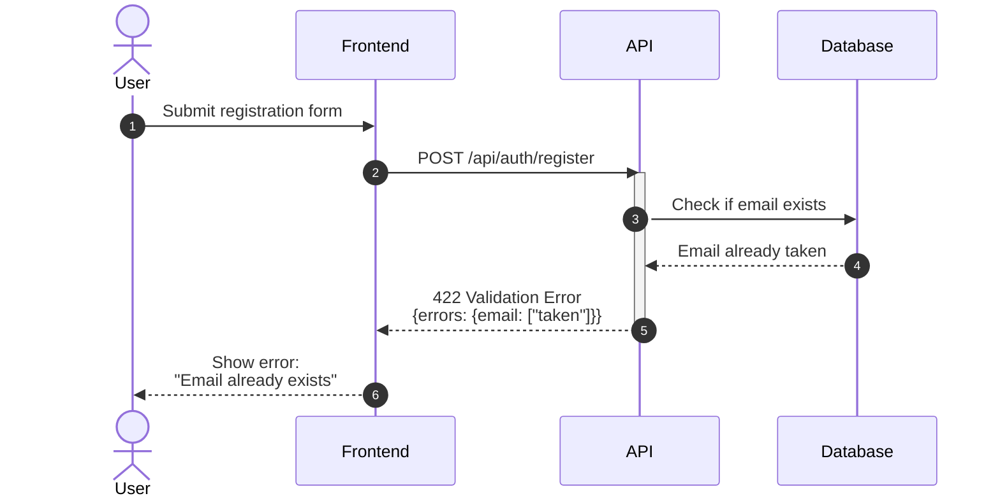
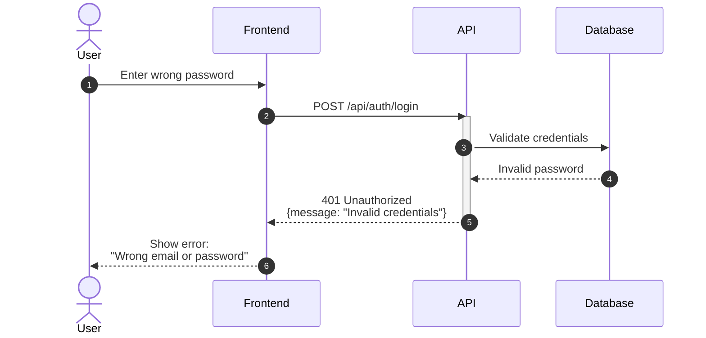
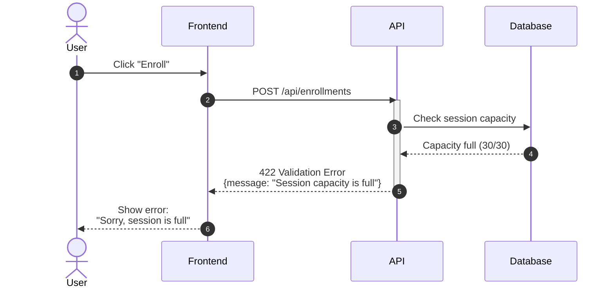
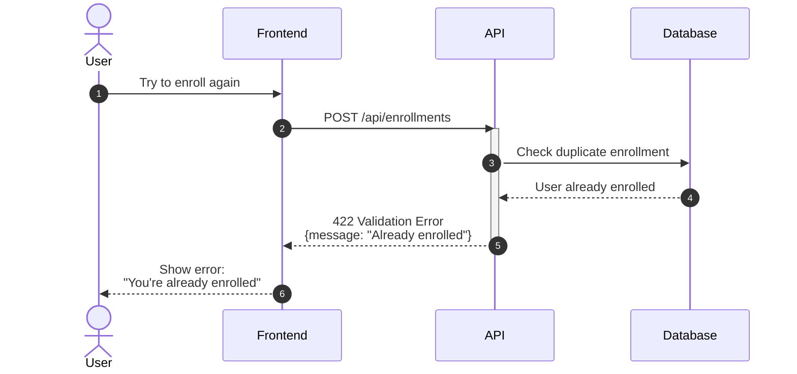
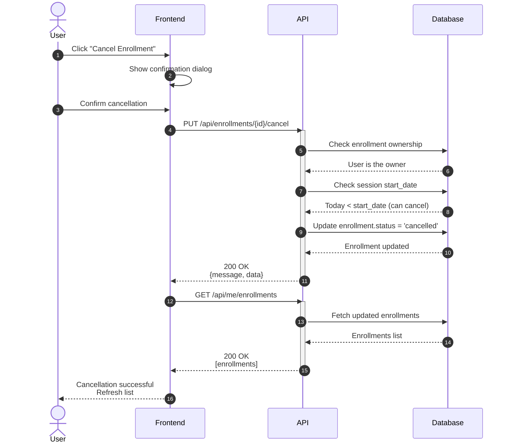

# Sequence Diagrams

User Flow Documentation for Training Management System

**Version:** 1.0.0
**Last Updated:** December 28, 2025

---

## Complete User Journey Flow

This diagram shows the complete user journey from registration through enrollment.

```mermaid
sequenceDiagram
    autonumber
    actor User
    participant Frontend
    participant API
    participant Database

    Note over User,Database: 1. REGISTRATION FLOW

    User->>Frontend: Fill registration form<br/>(name, email, password)
    Frontend->>API: POST /api/auth/register
    activate API
    API->>Database: Check if email exists
    Database-->>API: Email available
    API->>Database: Create user (role: student)
    Database-->>API: User created (id: 1)
    API->>Database: Generate Sanctum token
    Database-->>API: Token created
    API-->>Frontend: 201 Created<br/>{token, user}
    deactivate API
    Frontend->>Frontend: Store token in session
    Frontend-->>User: Registration successful<br/>Redirect to dashboard

    Note over User,Database: 2. LOGIN FLOW

    User->>Frontend: Enter credentials<br/>(email, password)
    Frontend->>API: POST /api/auth/login
    activate API
    API->>Database: Validate credentials
    Database-->>API: User found & password valid
    API->>Database: Generate new token
    Database-->>API: Token created
    API-->>Frontend: 200 OK<br/>{token, user}
    deactivate API
    Frontend->>Frontend: Store token
    Frontend-->>User: Login successful<br/>Show dashboard

    Note over User,Database: 3. UPDATE PROFILE FLOW

    User->>Frontend: Click "Account Settings"
    Frontend->>API: GET /api/me
    activate API
    API->>Database: Fetch user + profile + role
    Database-->>API: User data with profile
    API-->>Frontend: 200 OK<br/>{user, profile, avatar_present}
    deactivate API
    Frontend-->>User: Display profile form

    User->>Frontend: Fill profile data<br/>(phone, dob, gender, org, dept, bio)
    User->>Frontend: Submit profile
    Frontend->>API: PUT /api/me/profile<br/>(with Bearer token)
    activate API
    API->>API: Validate input
    API->>Database: Update users.name
    Database-->>API: Name updated
    API->>Database: Update/Create profile record
    Database-->>API: Profile saved
    API->>Database: Fetch fresh data
    Database-->>API: Updated user + profile
    API-->>Frontend: 200 OK<br/>{message, user}
    deactivate API
    Frontend-->>User: Profile updated successfully

    Note over User,Database: 3.1 UPLOAD AVATAR (Optional)

    User->>Frontend: Select avatar image
    Frontend->>API: POST /api/me/avatar<br/>(multipart/form-data)
    activate API
    API->>API: Validate image<br/>(jpeg/png/jpg/gif, max 2MB)
    API->>Database: Store BLOB + MIME type<br/>in profiles table
    Database-->>API: Avatar saved
    API-->>Frontend: 200 OK<br/>{message}
    deactivate API
    Frontend->>API: GET /api/me/avatar?t=timestamp
    activate API
    API->>Database: Fetch avatar BLOB
    Database-->>API: Binary image data
    API-->>Frontend: 200 OK<br/>Content-Type: image/jpeg
    deactivate API
    Frontend-->>User: Display new avatar

    Note over User,Database: 4. ENROLLMENT FLOW

    User->>Frontend: Browse programs page
    Frontend->>API: GET /api/catalog/programs
    activate API
    API->>Database: Fetch approved & active programs
    Database-->>API: Programs list
    API-->>Frontend: 200 OK<br/>[programs]
    deactivate API
    Frontend-->>User: Display program catalog

    User->>Frontend: Click on program
    Frontend->>API: GET /api/catalog/programs/{id}/sessions
    activate API
    API->>Database: Fetch approved & open sessions
    Database-->>API: Sessions list
    API-->>Frontend: 200 OK<br/>[sessions]
    deactivate API
    Frontend-->>User: Display available sessions

    User->>Frontend: Click "Enroll" on session
    Frontend->>API: POST /api/enrollments<br/>{session_id}
    activate API
    API->>Database: Check session status & approval
    Database-->>API: Session is approved & open
    API->>Database: Check capacity
    Database-->>API: Has available slots
    API->>Database: Check duplicate enrollment
    Database-->>API: User not enrolled yet
    API->>Database: Create enrollment<br/>(status: confirmed)
    Database-->>API: Enrollment created (id: 1)
    API-->>Frontend: 201 Created<br/>{message, data}
    deactivate API
    Frontend-->>User: Enrollment successful!<br/>Show confirmation

    User->>Frontend: View my enrollments
    Frontend->>API: GET /api/me/enrollments
    activate API
    API->>Database: Fetch user enrollments<br/>with session & program
    Database-->>API: Enrollments with relations
    API-->>Frontend: 200 OK<br/>[enrollments]
    deactivate API
    Frontend-->>User: Display enrolled courses
```



---

## Error Scenarios

### Registration Error - Email Already Exists



### Login Error - Invalid Credentials



### Enrollment Error - Session Full



### Enrollment Error - Already Enrolled



---

## Cancel Enrollment Flow



---

## Technical Details

### Authentication Flow

1. **Registration**: Creates user with `student` role by default
2. **Token Generation**: Uses Laravel Sanctum for API tokens
3. **Token Storage**: Frontend stores token in session/localStorage
4. **Token Usage**: Sent as `Authorization: Bearer {token}` header

### Profile Management

1. **Profile Fetch**: `GET /api/me` returns user + profile + avatar flag
2. **Profile Update**: `PUT /api/me/profile` updates both users and profiles tables
3. **Avatar Storage**: Binary BLOB in database (not file system)
4. **Avatar Retrieval**: `GET /api/me/avatar` streams image directly

### Enrollment Business Rules

1. **Session Status**: Must be `approved` AND `open`
2. **Capacity Check**: Current enrollments < session.capacity
3. **Duplicate Check**: One user can only enroll once per session
4. **Cancellation**: Only before session start_date
5. **Ownership**: Users can only cancel their own enrollments

---

## Database Transactions

### Enrollment Creation Transaction

```sql
BEGIN TRANSACTION;

-- 1. Lock session record
SELECT * FROM training_sessions
WHERE id = ?
FOR UPDATE;

-- 2. Count current enrollments
SELECT COUNT(*) FROM enrollments
WHERE session_id = ?
AND status = 'confirmed';

-- 3. Check if user already enrolled
SELECT COUNT(*) FROM enrollments
WHERE session_id = ?
AND user_id = ?;

-- 4. Insert enrollment if checks pass
INSERT INTO enrollments
(user_id, session_id, status, enrolled_at)
VALUES (?, ?, 'confirmed', NOW());

COMMIT;
```

---

## API Endpoint Summary

| Flow Step | Method | Endpoint | Auth Required |
|-----------|--------|----------|---------------|
| Registration | POST | /api/auth/register | No |
| Login | POST | /api/auth/login | No |
| Get Profile | GET | /api/me | Yes |
| Update Profile | PUT | /api/me/profile | Yes |
| Upload Avatar | POST | /api/me/avatar | Yes |
| Get Avatar | GET | /api/me/avatar | Yes |
| Delete Avatar | DELETE | /api/me/avatar | Yes |
| List Programs | GET | /api/catalog/programs | No |
| List Sessions | GET | /api/catalog/programs/{id}/sessions | No |
| Create Enrollment | POST | /api/enrollments | Yes |
| Cancel Enrollment | PUT | /api/enrollments/{id}/cancel | Yes |
| My Enrollments | GET | /api/me/enrollments | Yes |

---

**Last Updated:** December 28, 2025
**Version:** 1.0.0
